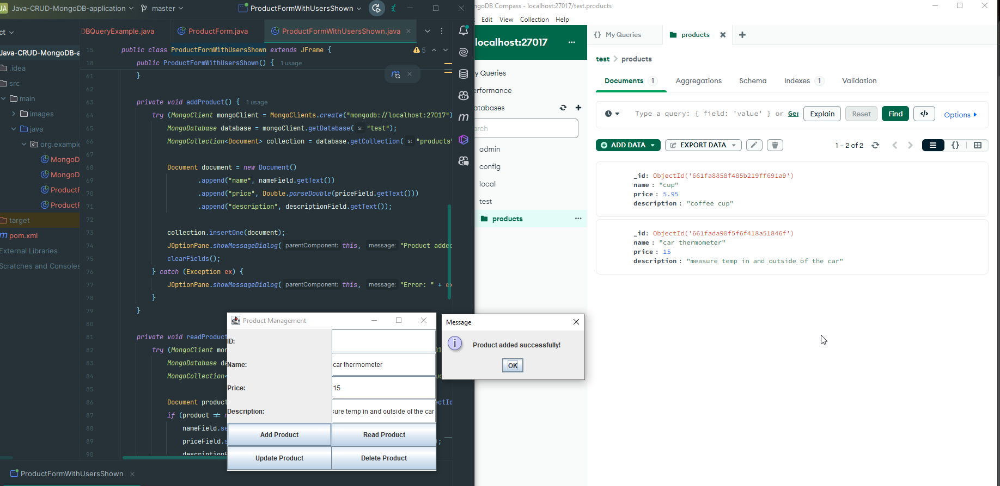

# Product Management CRUD Application

This is a simple CRUD (Create, Read, Update, Delete) application built in Java using MongoDB as the database.

## Description

This application allows users to perform basic CRUD operations on products stored in a MongoDB database.

## Features

- **Add Product**: Add a new product to the database.
- **Read Product**: Retrieve product details using its unique ID.
- **Update Product**: Update existing product details by the product ID.
- **Delete Product**: Remove a product from the database by the product ID.

## Requirements

- Java Development Kit (JDK)
- MongoDB installed and running locally
- MongoDB Compass installed

## Installation

1. Clone this repository to your local machine.
2. Make sure MongoDB is running locally.
3. Build the application using your favorite Java IDE or using command line tools.

## Usage

1. Run the application `ProductFormCRUDOperations`.
2. Use the provided GUI to perform CRUD operations on products.
3. Follow the prompts and input fields to add, read, update, or delete products.

## Screenshots

### Add Product

### Read Product

### Update Product

### Delete Product

product deleted

